# Architecture

## Stack decision

Use Flutter for the application shell with two independent playback engines.

| Concern | Choice | Why |
| --- | --- | --- |
| TV UI | Flutter Material primitives plus a custom focus layer | Full control over a branded 10-foot UI; every action is focusable and remote-driven. |
| TV navigation | `Focus`, `FocusTraversalGroup`, `Shortcuts`, and `Actions` | Predictable D-pad behavior without depending on the deprecated Android Leanback UI library. |
| Video | `flutter_vlc_player` plus `media_kit`/libmpv | VLC copy-back decoding is the compatibility default; MPV remains available for advanced libass rendering and as an independent fallback. |
| State | Riverpod | Testable feature-scoped state and dependency injection. |
| Routing | `go_router` | Declarative home, detail, auth, and player navigation. |
| HTTP | Dio | Timeouts, interceptors, cancellation, and typed service boundaries. |
| Secrets | `flutter_secure_storage` | Android Keystore-backed storage for user tokens. |
| Local state | SQLite (`sqflite`, WAL mode) | Exact resume, history, per-series settings, compatibility failures, catalog cache, and performance events. |
| Native TV | Kotlin method channel | MediaSession, Watch Next, reminders, codec/display/audio capabilities, and display mode selection. |
| Metadata | AniList GraphQL | Seasonal, trending, search, relations, cover art, and user list mutations. |
| Auth | Direct Real-Debrid device OAuth plus a tracker pairing broker | Real-Debrid exposes a TV-friendly device flow; AniList/MAL authorization is adapted by a small server so secrets never ship in the APK. |
| Debrid | Real-Debrid and TorBox APIs | Magnets are processed remotely and only provider-generated HTTPS streams reach either player. |

The native Kotlin/Compose for TV alternative has excellent first-party TV
components, but it would require maintaining custom native player surfaces and
track/control integration. The dual-engine Flutter design isolates firmware
decoder/renderer failures while preserving libass support.

## Module boundaries

```text
lib/
  app/                       app composition and routes
  core/
    config/                  compile-time, non-secret configuration
    theme/                   visual tokens
    tv/                      focus and remote input primitives
    platform/                Android TV native bridge
    storage/                 SQLite state and history
    diagnostics/             redacted support report export
  features/
    auth/                    pairing broker client and secure token handoff
    catalog/                 AniList metadata queries and domain models
    home/                    TV shelves and hero presentation
    player/                  VLC/MPV lifecycle, failover, and remote controls
    streaming/               Torrentio picker plus Real-Debrid/TorBox resolvers
    tracking/                MAL/AniList list and mutation contracts
```

Each integration sits behind a domain interface. UI code must not know whether
a release came from a local provider adapter, a hosted resolver, or a test
fixture.

## Playback pipeline

```mermaid
flowchart LR
    A["Episode selection"] --> B["Title and episode normalizer"]
    B --> C["Release source adapters"]
    C --> D["Candidate scorer"]
    D --> E["Choose connected debrid service"]
    E --> F["Add magnet to Real-Debrid or TorBox"]
    F --> G["Inspect and select the episode file"]
    G --> H["Poll status and progress"]
    H -->|Cached: completes quickly| I["Request provider HTTPS stream"]
    H -->|Uncached: download completes| I
    I --> J["Debrid-only player gate"]
    J --> K["VLC compatibility player"]
    K -->|Manual engine switch| K1["MPV/libass player"]
    K --> K2["Checkpoint, MediaSession, Watch Next"]
    K -->|Decode or host failure| D
    K1 --> K2
    K1 -->|Decode or host failure| D
    K2 --> L["Tracking completion policy"]
    L --> M["Durable sync outbox"]
    M --> N["AniList and/or MAL mutation"]
```



Important implementation rules:

- Normalize AniList titles, synonyms, season number, episode number, release
  group, resolution, codec, and batch status before ranking results.
- Real-Debrid no longer documents its former instant-availability endpoint.
  Add the magnet, select the matching file, and use torrent status/progress;
  cached entries normally reach `downloaded` almost immediately.
- A batch must select only the matching video file. Both engines expose
  embedded audio/subtitle tracks; MPV can also use Matroska font attachments.
- Keep debrid and source-provider API code outside widgets.
- Treat an unrestrict URL as short-lived and never persist it in logs.
- Emit playback progress locally. Queue a tracking mutation after natural
  completion or a configurable threshold (for example, 85-90%), and make the
  mutation idempotent so retries cannot decrease progress.
- Keep the tracking outbox locally until both the provider response and local
  state agree.

Only index and stream material the user is legally permitted to access. Source
adapter terms and AniList API terms must be reviewed before public
distribution.

## Player behavior in this foundation

`TvPlayerScreen` starts with libVLC using MediaCodec decoding without direct
surface rendering. VLC automatically falls back to software decoding; the UI
can also switch to MPV, which is configured with libass and a bundled Noto Sans
fallback font. The custom overlay disables touch-oriented stock controls:

- D-pad arrows: reveal and navigate the focusable control row; they never seek
  while a control has focus.
- Center/Enter/K: activate the focused control or play/pause from the player
  root.
- J/L or media rewind/fast-forward: seek 10 seconds and show a trickplay
  preview when the device permits frame capture.
- S: cycle subtitles; M/gamepad Y: open playback options; A/gamepad X: cycle
  picture fit; C: engage software compatibility decoding.
- Back: return through normal Android navigation.

The default VLC mode uses hardware decoding with copied frames, avoiding the
corrupt green-line and stride artifacts caused by direct/zero-copy Android
surfaces on some Fire TV and budget TV chipsets. On a decoder error it restarts
at the saved position with VLC software decoding, then tries the next ranked
stream. The player options can switch to the independent MPV/libass engine at
any time. Validate HEVC 10-bit, AV1, Dolby/DTS licensing behavior, and ASS-heavy
samples on each target box; emulator success is not enough for codec
certification.
